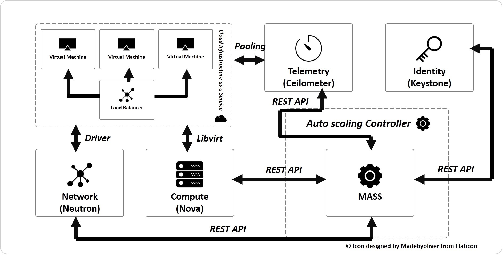
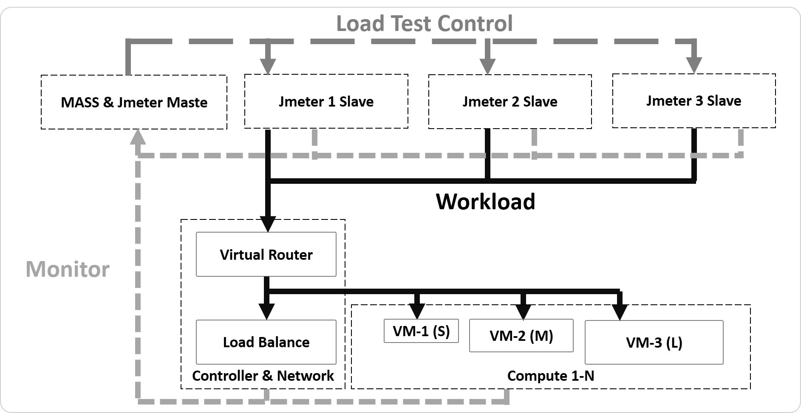

## MAAS v2017
**PROPOSED APPROACH**
The MASS software has been developed using Python 2.7 and OpenStack Mitaka. This software is an independent software that interface with OpenStack using OpenStack REST API. MASS communicate with Ceilometer to get the workload information. 


Figure 1. The interaction between MASS software and OpenStack components

As MASS start, a pool of resources will be created in OpenStack using API, then a set point of maximum workload and minimum workload will be set into Ceilometer. When the workload increases and exceeds the maximum set point, Ceilometer will report back as a notification to MASS. Upon receiving the notification, MASS will execute the workload scaling policy, then use OpenStack API to create a new VM to enable a workload sharing on more physical machines.  If the workload decreases and becomes less than the minimum threshold, the notification will be sent to MASS. Upon receiving the notification, MASS will make a decision based on its policy and shutdown some VM to save the resources. The policy can be easily coded into the MASS system. Currently, the policy available is only the round-robin VM creation on the physical machine. 

**CONCEPT & ENVIRONMENT LAB**
The test environment composed of a set of 7 computers.  One computer is used as an OpenStack controller and 2 more are used as OpenStack compute nodes base on CPU Intel Q6600 2.4Ghz, Memory 6GB DDR2, HDD80GB SATA.  The rest are used as load generator. The test has been conducted using Jmeter version 3.1 (B. Erinle, 2014) as the workload generator. The main load test computer base on CPU Intel I7-4700MQ 2.4Ghz, Memory 16GB DDR3, SSD240GB SATA installed with Windows 7 and two more load test slave base on CPU Intel E750 2.93Ghz, Memory 2GB DDR3, HDD160GB SATA for Jmeter used CentOS7.  The rest is installed with Linux CentOS Version 7.2. The test configuration is as shown in Figure. 2. In this test, we pre-created 3 VM types; small size (s), medium size (M), and large size (L). 


Figure 2. The test system configuration

Keyword : OpenStack, Cloud Computing, Cloud Media Server, Auto-Scaling Software

This software was part of Teshis when I was at university. Thank you to all who are interested.

## Installation
Pre-Software Request for MAAS Controller 

1. CentOS 7.2
2. Python 2.7
3. OpenStack Client & Software Development Kit

```
yum install epel-release
yum install python-devel python-pip gcc

pip install python-openstackclient

pip install https://pypi.python.org/packages/b5/b9/249090e22e2c7c0aa640ac7d3cf154bbdd868b586939e1e7de520cff35cd/python-novaclient-7.0.0.tar.gz

Name: python-openstackclient
Version: 3.7.0
pip install python-openstackclient
pip install https://pypi.python.org/packages/28/50/902e4288d5aa87a291c0a771028b8db26e5c967fb1471022ef8e660562f8/python-openstackclient-3.7.0.tar.gz

Name: python-keystoneclient
Version: 3.9.0
pip install python-keystoneclient
pip install https://pypi.python.org/packages/a6/69/03a3121c0eb2017c44a41762e6c9671dc49006598f9502614f26563a158e/python-keystoneclient-3.9.0.tar.gz

Name: python-glanceclient
Version: 2.5.0
pip install python-glanceclient
pip install https://pypi.python.org/packages/93/4d/b8ddde77ed12292e376ea10b81b34ba87152b617416d028888de02022717/python-glanceclient-2.5.0.tar.gz

Name: python-novaclient
Version: 7.0.0
pip install python-novaclient
pip install https://pypi.python.org/packages/b5/b9/249090e22e2c7c0aa640ac7d3cf154bbdd868b586939e1e7de520cff35cd/python-novaclient-7.0.0.tar.gz

Name: python-neutronclient
Version: 6.0.0
pip install python-neutronclient
pip install https://pypi.python.org/packages/50/4d/b0b3b3bfd678a0b3e0ce16bbd539dab1e7718f98d53787efbd41083828fb/python-neutronclient-6.0.0.tar.gz

Name: python-ceilometerclient
Version: 2.7.0
pip install python-ceilometerclient
pip install https://pypi.python.org/packages/98/5e/ef6f026a9f5275e54800273ac4868bf50ab4c6b1cab299f2249f7978bd29/python-ceilometerclient-2.7.0.tar.gz

Name: python-heatclient
Version: 1.7.0
pip install python-heatclient
pip install https://pypi.python.org/packages/99/25/7252a5286c2669beda1a16f16abe02bbb31ee9e54de4c36ed79a75b5ae76/python-heatclient-1.7.0.tar.gz
```

Install OpenStack Cluster ans MAAS
```
vi /etc/default/grub
####################
net.ifnames=0
####################
grub2-mkconfig -o /boot/grub2/grub.cfg
reboot

vi /etc/environment
#####################
LANG=en_US.utf-8
LC_ALL=en_US.utf-8
#####################
reboot
locale

vi /etc/hosts
#####################
192.168.1.9	maas
192.168.1.10    controller
192.168.1.11	network
192.168.1.12    compute1
192.168.1.13    compute2
192.168.1.14	compute3
192.168.1.19	loadmaster
192.168.1.20    load1
192.168.1.21    load2
192.168.1.22    load3
192.168.1.236   media.local
#####################

yum -y install epel-release

sudo systemctl disable firewalld
sudo systemctl stop firewalld
sudo systemctl disable NetworkManager
sudo systemctl stop NetworkManager
sudo systemctl enable network
sudo systemctl restart network

yum -y install chrony
vi /etc/chrony.conf
#####################
server controller iburst

allow 192.168.1.0/24
#####################
systemctl start chronyd
systemctl enable chronyd

systemctl restart chronyd
chronyc sources

sudo yum install -y centos-release-openstack-mitaka
sudo yum update -y

sudo yum install -y openstack-packstack
sudo yum update -y

packstack --default-password='passw0rd' --os-controller-host='192.168.1.10’ --os-network-hosts='192.168.1.11’ --os-compute-hosts='192.168.1.12,192.168.1.13,192.168.1.14' --provision-demo=y  --os-ceilometer-install='y' --os-heat-install='y' --os-neutron-lbaas-install='y' --os-neutron-ovs-bridge-mappings='extnet:br-ex' --os-neutron-ovs-bridge-interfaces='br-ex:eth0' --os-neutron-ml2-type-drivers='vxlan,flat'

yum install -y java unzip
```

## Contributing
Pull requests are welcome. For major changes, please open an issue first to discuss what you would like to change.

Please make sure to update tests as appropriate.

## License
[Unlicense](https://unlicense.org)
